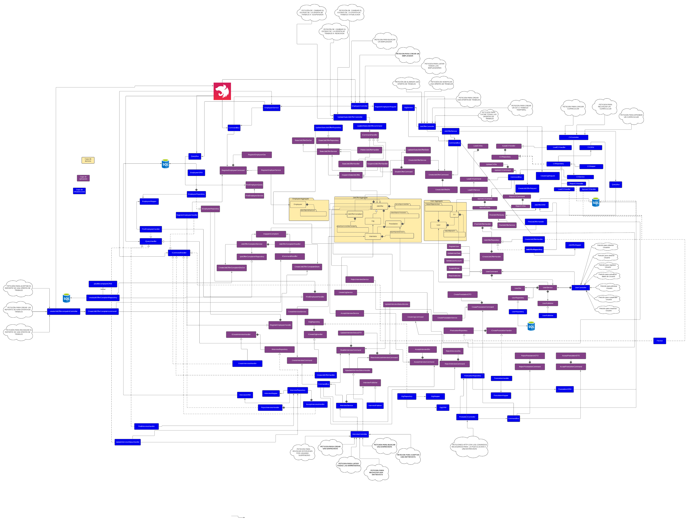
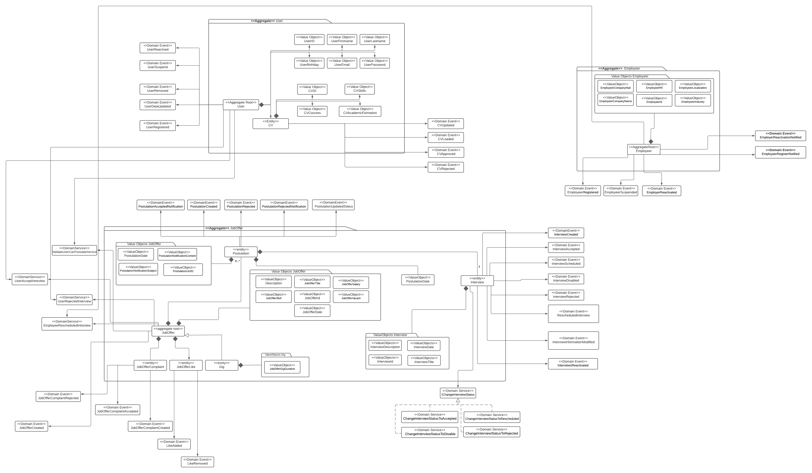

# Git and Job (Backend Service)
Backend para git and job, un sistema de búsqueda y aplicación de empleos tanto fijos como gits. Este repositorio tiene como objetivo desplegar el servicio backend para la aplicación web y móvil haciendo uso de Domain Driven Design y Arquitectura Hexagonal.

## 🚀Iniciando 
Estas instrucciones servirán para obtener una copia del proyecto en funcionamiento en su máquina local con el fin de desarrollar y realizar pruebas.

## Diagrama de Arquitectura hexagonal 


## Diagrama de estereotipos de domino


### 📋Pre-requisitos 
* [Node.js](https://nodejs.org/es/) - Entorno de ejecución para javascript.
* [Typescript](https://www.typescriptlang.org) - Lenguaje de Programación para nuestro modelo de dominio (ddd).
* [Git](https://git-scm.com) - Manejador de versiones.
 
## 🔧Instalación 

Para instalar [Node.js](https://nodejs.org/es/) es necesaria la version `16.x.x` en adelante. (recomendado). Al finalizar comprobamos si la instalación fue exitosa.

```
node -version
```
Posteriormente, se procede a instalar [Typescript](https://www.typescriptlang.org) haciendo uso de npm.

```
npm install typescript --save-dev 
```
Procedemos a clonar el repositorio
```
git clone https://github.com/TeamTron2021/gigandjob-backend.git
```
Después
```
cd gigandjob-backend
```
Instalamos los módulos necesarios 
```
npm install
```
## ⚙️Corriendo pruebas
Para esta primera version del proyecto se utilizarán pruebas unitarias para validar el correcto funcionamiento de las clases.
```
npm run test
```
## 🖥️Despliegue

### Método Local
Se debe de crear un documento .env en la raíz del proyecto con las credenciales necesarias
```
DB_HOST=
DB_PORT=
DB_USER=
DB_PASSWORD=
DB_DATABASE=
JWT_SECRET=
```

Posteriormente, ya se puede desplegar el backend de forma local (sin docker)
```
npm run start 
```
### Haciendo uso de Docker 
Modo Desarrollador
```
docker compose up
docker compose up prod 
docker compose up postgres
```
Modo Producción
```
docker compose up
docker compose up prod 
docker compose up postgres
```
### Via Internet 

Para hacer uso del backend via internet: [Backend](https://gigandjob-backend.herokuapp.com/)


## 🛠️Construido con 
* [Node.js](https://nodejs.org/es/) - Entorno de ejecución para javascript.
* [Typescript](https://www.typescriptlang.org) - Lenguaje de Programación para nuestro modelo de dominio (ddd).
* [Git](https://git-scm.com) - Manejador de versiones.
* [Jest](https://jestjs.io) - Framework para pruebas.
* [uuid](https://www.npmjs.com/package/uuid) - Soporte para uuid (versiones 1, 2, 3, 4 y 5).
* [crypto](https://nodejs.org/api/crypto.html) - Soporte para uuid.
* [Nestjs](https://nestjs.com) - Framework Backend.
* [Class Transformer](https://www.npmjs.com/package/class-transformer) - Transforma la clase para hacer la petición.
* [Class Validator](https://www.npmjs.com/package/class-validator) - Valida los campos necesarios de un request.
* [@hapi/joi](https://www.npmjs.com/package/@hapi/joi) - Valida los campos del .env.
* [typeorm](https://www.npmjs.com/package/typeorm) - Permite conexión con la base de datos y realizar querys.
* [pg](https://www.npmjs.com/package/pg) - Permite trabajar ORM con Postgresql.
* [@nestjs/passport](https://www.npmjs.com/package/@nestjs/passport) - Librería para autenticación para Nestjs.
* [passport](https://www.npmjs.com/package/passport) - Librería para autenticación para Nestjs.
* [@nestjs/jwt](https://www.npmjs.com/package/@nestjs/jwt) - Librería para autenticación para Nestjs con tokens.
* [passport-jwt](https://www.npmjs.com/package/passport-jwt) - Librería para autenticación para Nestjs con tokens.
* [@types/passport-jwt](https://www.npmjs.com/package/@types/passport-jwt) - Librería para autenticación para Nestjs con tokens.

## ✒️Autores
* **Carlos Alonzo** - [cealonzo](https://github.com/cealonzo)
* **Pablo Perez** - [PabloP16](https://github.com/PabloP16)
* **Carlos Freitas** - [trekexol](https://github.com/trekexol)
* **Ruben Gomes** - [RubenDGomesdev](https://github.com/RubenDGomesdev)
* **Andrea Mendoza** - [andreaamg22](https://github.com/andreaamg22)
* **Ruth Rivas** - [RHRivasG](https://github.com/RHRivasG)
* **Diego Rojas** - [superdie18](https://github.com/superdie18)
* **Javier Flores** - [javier0997](https://github.com/javier0997)
* **Valentina Figueroa** - [valenfigue](https://github.com/valenfigue)
  * Implementó el despliegue automático del backend a Heroku (incluyendo el GitHub Action de Docker).
* **Juan Carlos Andrade** - [jotacee98](https://github.com/jotacee98)
* **Joselyn Gonzalez** - [joselyn1](https://github.com/joselyn1) 
* **Jose L Chirinos** - [JoseChirinos36](https://github.com/JoseChirinos36) 
---
Hecho con ❤️ por [Team Tron](https://github.com/TeamTron2021) 😊
